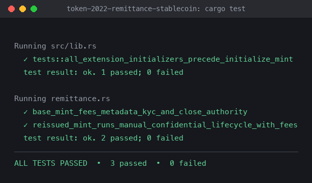

# Token-2022 Remittance Stablecoin

Week 4 assignment: a Token-2022 remittance stablecoin with a protocol-level transfer fee, KYC freezing, on-chain metadata, a mint close authority, and a re-issued mint with a seizure authority and confidential transfers.

Tests run locally with LiteSVM.

## What it does

- **Fee on every transfer.** The mint stacks `TransferFeeConfig`, and transfers use `transfer_checked_with_fee` with the fee computed live via `calculate_epoch_fee(current_epoch, amount)`, never a cached rate.
- **KYC freezing.** `DefaultAccountState` is `Frozen`, so every new account starts frozen. The freeze authority thaws individual accounts after KYC, separate from any mint-level default-state change (proven by a fresh account still starting frozen after other accounts are thawed).
- **On-chain metadata.** `MetadataPointer` points at the mint itself, so wallets read metadata without trusting an off-chain registry.
- **Mint close authority.** `MintCloseAuthority` lets the issuer close the mint if it is ever decommissioned.
- **State read exclusively through `StateWithExtensions`.** No raw `Pack::unpack` anywhere in the crate.
- **Re-issued mint with seizure + confidentiality.** Since confidential transfers cannot be added after creation, the mint is re-issued carrying the same extension set forward, adding `PermanentDelegate` (seizure authority) and confidential transfers with `approve_policy = manual`.
- **Full confidential lifecycle.** Owner-signed `ConfigureAccount` (distinct from account creation), `ApproveAccount`, `DepositConfidentialTokens`, `ApplyPendingBalance`, a confidential fee-bearing `Transfer`, and `WithdrawConfidentialTokens` after applying pending balance.

## Gap analysis: seizure vs. confidentiality

The written finding on what happens if a sanctioned user moves funds into the confidential system before the permanent delegate acts is in [`docs/FINDING.md`](docs/FINDING.md). Short version: the permanent delegate only moves the plaintext `amount` field. Once funds are in the confidential `pending_balance`/`available_balance`, only the account owner's own ElGamal/AES keys can touch them. Freezing still blocks the account either way, but it cannot claw funds back.

## Extension challenge

Not attempted. The delegated-authority agent program (top-level `approve_checked` plus a CPI-signed `transfer_checked_with_fee`, then CPI Guard) would need its own on-chain program and deploy pipeline on top of an already large confidential-transfer build. Given the time spent getting the core 6 tasks and the confidential lifecycle working end to end (see "A note on the test environment" below), this was left out rather than shipped half-done.

## A note on the test environment

LiteSVM 0.10.0's bundled Token-2022 program is compiled without the `zk-ops` feature, so `Deposit`/`Withdraw`/`Transfer`/`TransferWithFee`/`ApplyPendingBalance` all fail. `tests/fixtures/spl_token_2022_zkops.so` is a local rebuild of `spl-token-2022` v10.0.0 with default features (`cargo build-sbf`), loaded over the same program ID in `tests/common/mod.rs::new_svm()`. Confidential-transfer proofs are generated with `spl-token-confidential-transfer-proof-generation` and embedded via `ProofLocation::InstructionOffset`, verified by the native `zk_elgamal_proof_program` builtin.

## Run it

```bash
cargo test
```



## Code

```
src/lib.rs                       # mint plans, fee transfer, thaw, StateWithExtensions readers
tests/
├── common/mod.rs                # LiteSVM setup, mint/account helpers
├── common/confidential.rs       # confidential lifecycle helpers (proof generation)
├── remittance.rs                # the two integration tests
└── fixtures/spl_token_2022_zkops.so  # zk-ops-enabled Token-2022 build
docs/
├── FINDING.md                   # written finding on the seizure/confidentiality gap
└── test-results.png
```

## License

MIT
